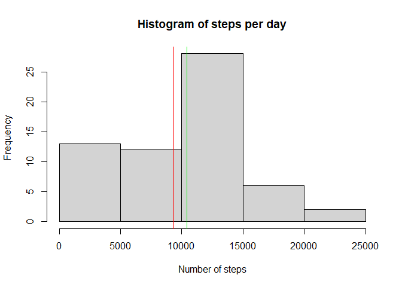
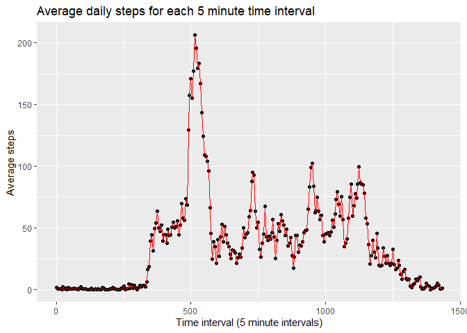
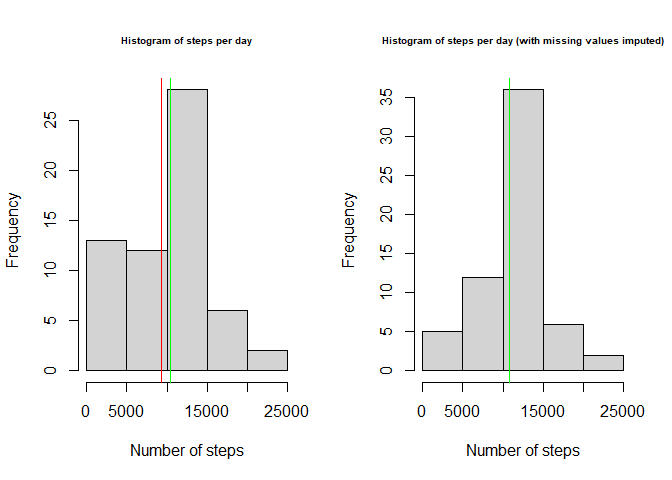
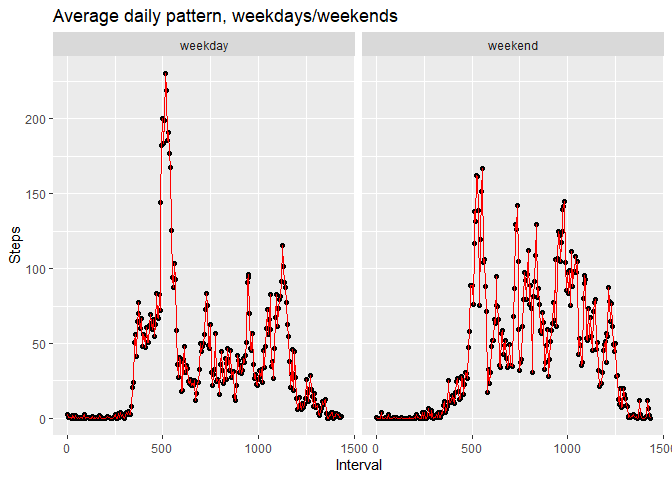

## Loading and preprocessing the data
Since I'll be working with the interval data, I'm changing it to go from 0 to 1435 (24*60) split into 5 minute intervals. Then I load up dplyr, tidyr and ggplot2 as libraries I'll use from time to time throughout the analysis 

```r
d <- read.csv("activity.csv")
d$interval <- seq(0,1435, 5)

library(ggplot2)
library(dplyr)
```

```
## 
## Attaching package: 'dplyr'
```

```
## The following objects are masked from 'package:stats':
## 
##     filter, lag
```

```
## The following objects are masked from 'package:base':
## 
##     intersect, setdiff, setequal, union
```

```r
library(tidyr)
```


## What is mean total number of steps taken per day?
Here I create a dataframe of number of steps per day, which I then use to make a histogram and find the mean of the data

```r
temp <- tapply(d$steps, d$date, sum, na.rm=TRUE)
df <- data.frame(date=names(temp),steps=temp)
rownames(df) <- c()
head(df)
```

```
##         date steps
## 1 2012-10-01     0
## 2 2012-10-02   126
## 3 2012-10-03 11352
## 4 2012-10-04 12116
## 5 2012-10-05 13294
## 6 2012-10-06 15420
```

```r
hist(df$steps, main="Histogram of steps per day", xlab="Number of steps")
abline(v=mean(df$steps), col="red")
abline(v=median(df$steps), col="green")
```

<!-- -->

```r
mean(df$steps)
```

```
## [1] 9354.23
```

```r
median(df$steps)
```

```
## [1] 10395
```


## What is the average daily activity pattern?
The average daily activity pattern will be equal to the mean for each time interval (for instance how many steps, on average, are taken in the interval between 07:00 and 07:05).  </br>Since the intervals labels already mach up to the actual time intervals across a 24 hour window, we simply have to calculate the mean for each of them, and plot the result.  

```r
avgSteps <- tapply(d$steps, d$interval, mean, na.rm=TRUE)
qplot(as.numeric(names(avgSteps)), avgSteps, xlab="Time interval (5 minute intervals)", ylab="Average steps", main ="Average daily steps for each 5 minute time interval")+geom_line(color="red")
```

<!-- -->

```r
highestInterval <- d$interval[which.max(avgSteps)]
highestInterval
```

```
## [1] 515
```

```r
paste(floor(highestInterval/60), ":", highestInterval%%60)
```

```
## [1] "8 : 35"
```
We see that, on average, the most steps are taken during the 515th time interval, corresponding to the time interval starting at 08:35 and ending at 08:40.

## Imputing missing values
I start by computing the amount of rows with missing values, both in terms of absolute numbers and %. I also double check that this is the same as the number of NAs in the steps column, to make sure wer'e not suddenly missing a date or interval label

```r
nas <- summary(complete.cases(d))
nas 
```

```
##    Mode   FALSE    TRUE 
## logical    2304   15264
```

```r
paste(as.numeric(nas[2])/17568*100 , "%")
```

```
## [1] "13.1147540983607 %"
```

```r
nas == summary(!is.na(d$steps))
```

```
##  Mode FALSE  TRUE 
##  TRUE  TRUE  TRUE
```


I'll keep things simple when imputing the missing values: if a value is missing, I want it to be replaced with the mean for that interval of time across (like we looked at above) 


```r
na <- is.na(d$steps)
avgStepsList <- as.list(avgSteps)

#Filling in the data
d[na,]$steps <- avgStepsList[as.character(d[na,]$interval)]
d$steps <- unlist(d$steps)
```
</br>Now that there's no more missing data, I can recalculate the average total and mean number of steps per day to see if it differs from what we found above

```r
temp <- tapply(d$steps, d$date, sum)
df2 <- data.frame(date=names(temp), steps=temp)
rownames(df2) <- c()
head(df2)
```

```
##         date    steps
## 1 2012-10-01 10766.19
## 2 2012-10-02   126.00
## 3 2012-10-03 11352.00
## 4 2012-10-04 12116.00
## 5 2012-10-05 13294.00
## 6 2012-10-06 15420.00
```

```r
#Set plot panels
par(mfrow=c(1,2), cex.main=0.65)

#Replot the histogram from above
hist(df$steps, main="Histogram of steps per day", xlab="Number of steps")
abline(v=mean(df$steps), col="red")
abline(v=median(df$steps), col="green")

#Plot a new histogram for the dataset with imputed values
hist(df2$steps, main="Histogram of steps per day (with missing values imputed)", xlab="Number of steps")
abline(v=mean(df2$steps), col="red")
abline(v=median(df2$steps), col="green")
```

<!-- -->

```r
#Print the mean and median for both datasets
paste("Mean (no imputed values):", mean(df$steps), " Mean (imputed values):", mean(df2$steps))
```

```
## [1] "Mean (no imputed values): 9354.22950819672  Mean (imputed values): 10766.1886792453"
```

```r
paste("Median (no imputed values):", median(df$steps), " Median (imputed values):", median(df2$steps))
```

```
## [1] "Median (no imputed values): 10395  Median (imputed values): 10766.1886792453"
```
We see that the mean number of steps per day has increased from about 9300 to about 10700 (or by roughly 1400 steps), and that the median is now equal to the mean (which makes sense since we injected a whole bunch of values equal to the mean for the various intervals)  


## Are there differences in activity patterns between weekdays and weekends?
First we have to start by figuring out which days fall during the weekend and which ones don't. To do that I'll start by converting the date column of d into dates with the as.Date function.
</br>(Sidenote: I'll keep using the dataset with imputed values for this part.)</br>

```r
d$date <- as.Date(d$date, format="%Y-%m-%d")
#In case your date functions don't default to english (like mine...)
Sys.setlocale("LC_TIME", "C")
```

```
## [1] "C"
```
Then I'll create a logical vector of whether a given date is a saturday or sunday, which I'll store in a column called weekend. If weekend = TRUE, the date falls on the weekend, if not, it doesn't 

```r
d$weekend <- weekdays(d$date) == "Saturday"|weekdays(d$date) == "Sunday"
head(d)
```

```
##       steps       date interval weekend
## 1 1.7169811 2012-10-01        0   FALSE
## 2 0.3396226 2012-10-01        5   FALSE
## 3 0.1320755 2012-10-01       10   FALSE
## 4 0.1509434 2012-10-01       15   FALSE
## 5 0.0754717 2012-10-01       20   FALSE
## 6 2.0943396 2012-10-01       25   FALSE
```

```r
summary(d$weekend)
```

```
##    Mode   FALSE    TRUE 
## logical   12960    4608
```
I then do some processing/reformatting to get the daily average pattern for weekdays/weekends, before finally plotting it. 

```r
temp <- tapply(d$steps, list(d$interval, d$weekend), mean)
df3 <- data.frame(interval=row.names(temp), weekday=temp[,1], weekend=temp[,2])
rownames(df3) <- c()
df3 <- gather(df3, key="day.end", value=steps, -interval)

g <- ggplot(df3, aes(as.numeric(interval), as.numeric(steps)))+facet_grid(.~df3$day.end)+geom_point()+geom_line(color="red")+labs(title="Average daily pattern, weekdays/weekends")+xlab("Interval")+ylab("Steps")
g
```

<!-- -->
